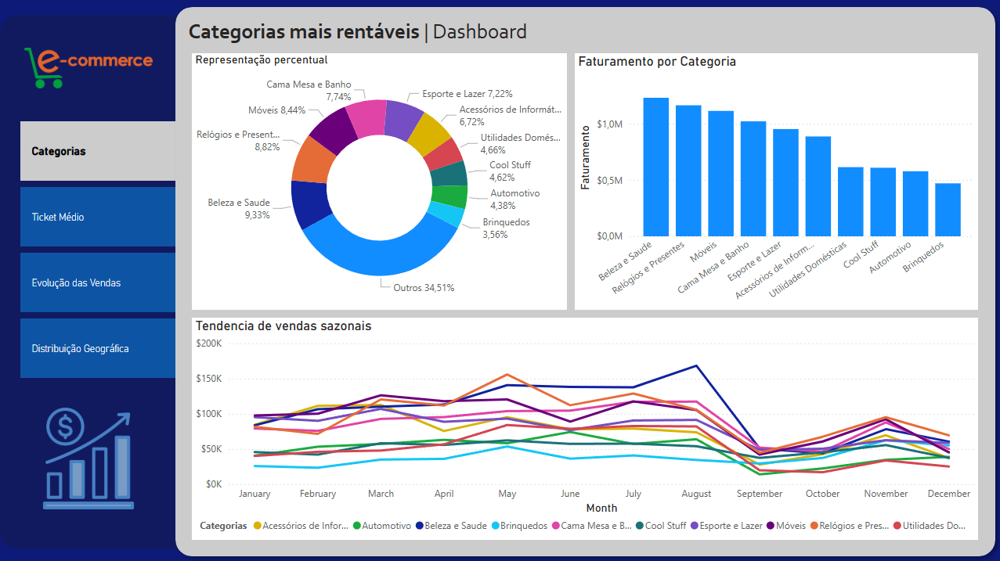
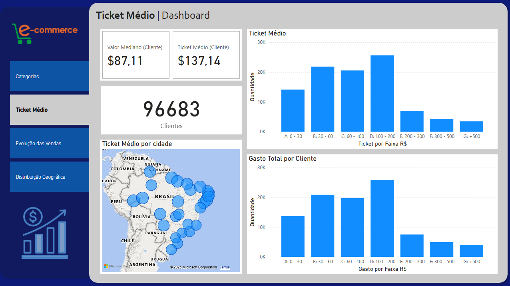
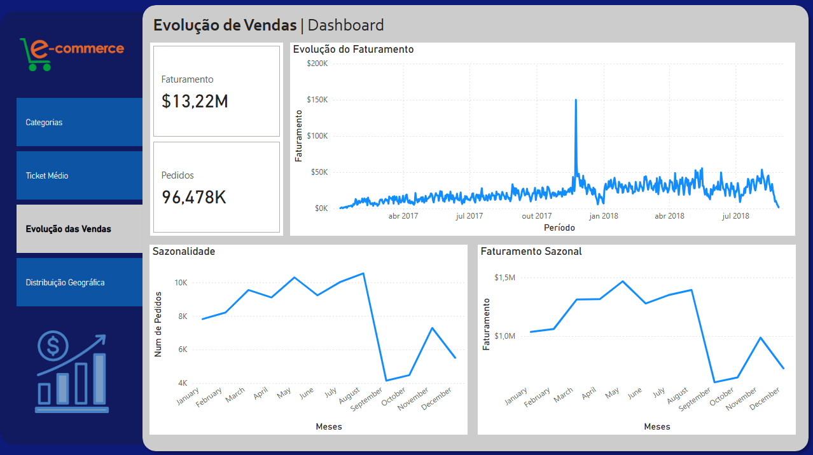
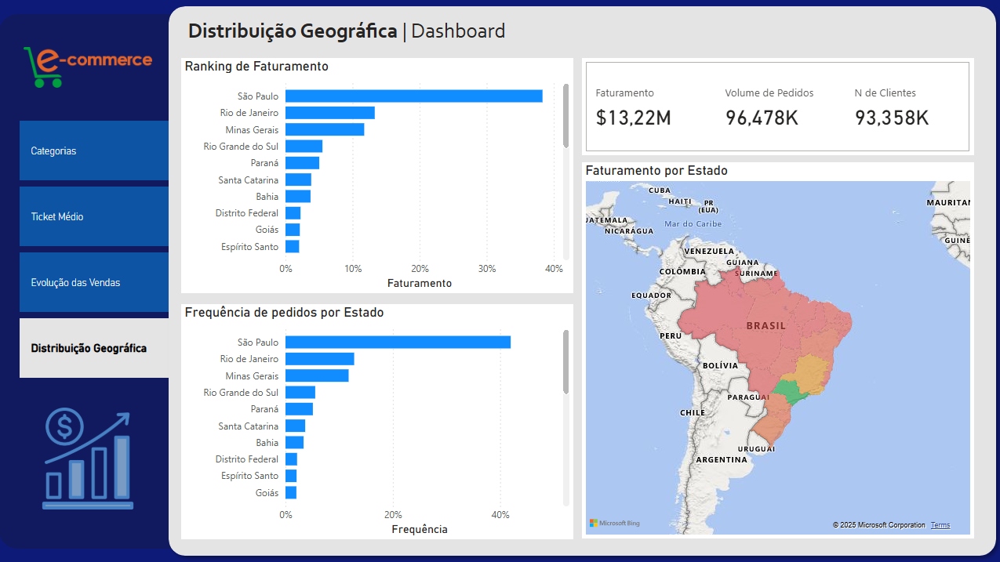

# 📊 Projeto: Relatório de Análise de Vendas — E-commerce Fictício

## Contexto

A empresa E-Shop Brasil busca entender melhor o comportamento de suas vendas nos últimos 3 anos. O objetivo é identificar categorias de produtos mais relevantes, perfil de clientes e oportunidades de crescimento.

## 📌 Principais Perguntas de Negócio (KPIs)

1. Quais são as categorias mais vendidas?
2. Qual é o ticket médio por cliente?
3. Como está a evolução de vendas ao longo do tempo?
4. Qual a distribuição geográfica dos clientes?
5. Existem padrões de sazonalidade nas vendas?

## 🗂 Estrutura do Repositório
> E-COMMERCE_SALES-DATA-ANALYSIS/ <br />
> ├── data/ -> dados brutos e tratados <br />
> ├── notebooks/ -> notebooks de exploração, limpeza e análise <br />
> ├── src/ -> scripts Python reutilizáveis <br />
> ├── reports/ -> visualizações e dashboard Power BI <br />
> └── README.md -> documentação do projeto <br />

## 🔧 Tecnologias Usadas
- Python
- Pandas
- Power BI
- Jupyter Notebook

## 📊 Resultados Principais

### 1. Quais são as categorias mais vendidas? 
- Podemos concluir que as categorias com maior faturamento são "Beleza e Saúde", "Relógios e Presentes" e "Móveis" representando 26,59% do montante total. 
- Percebemos que as 10 categorias com maior faturamento compoem 65,49% do montante total.


### 2. Qual é o ticket médio por cliente?
- É notavel que os cliente, em média, gastam até 200 reais, representando 84,9% da frequência de ticket médio, sendo a faixa mais representativa entre 100 a 200 reais.
- Podemos notar ao olhar para o gasto total e os ticket a maioria absoluta dos cliente realizaram apenas uma unica compra.


### 3. Como está a evolução de vendas ao longo do tempo?
- Analisando o faturamento por tempo, podemos concluir que as vendas seguem em crescimento constante.


### 4. Qual a distribuição geográfica dos clientes?
- A maior concentração de pedidos e do faturamento está concentrado em São Paulo, Rio de Janeiro e Minas Gerais.
- São Paulo representa 41,98% dos pedidos e 38,33% do Faturamento


### 5. Existem padrões de sazonalidade nas vendas?
- Quando olhando de forma amostral para o ano completo dentro dos dados, percebemos que em novembro as vendas aumentam.
- Em maio as vendas começam a tendencia de crescimento que atinge seu pico em novembro e dezembro.

## 🚀 Como Reproduzir
1. Clone este repositório:
   ```bash
   git clone https://github.com/<seu-usuario>/projeto-ecommerce.git

2. Instale as dependências:
    ```bash
    pip install -r requirements.txt

3. Execute os notebooks na pasta notebooks/.

## 📌 Fonte dos Dados

[Olist E-commerce Dataset - Kaggle](https://www.kaggle.com/datasets/olistbr/brazilian-ecommerce)

